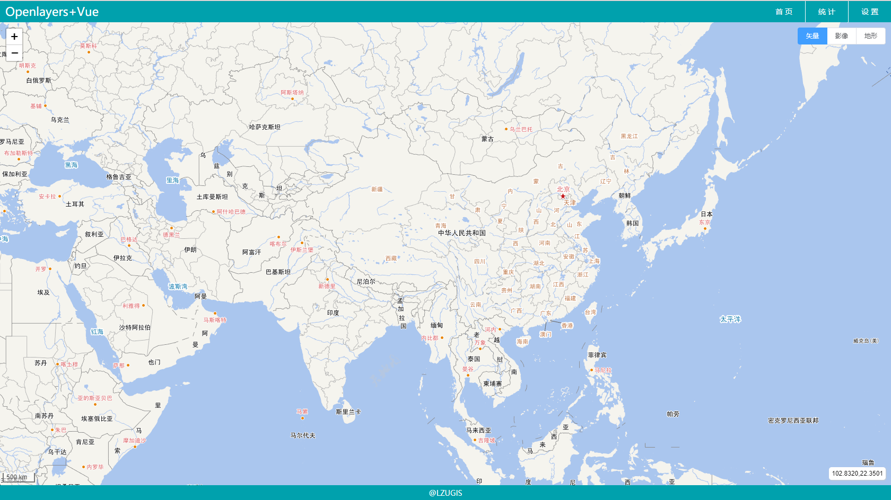

VUE（Element）+OL5+leaflet Demo
====================

# 实现功能
1、Vue和Element；

2、创建地图适配器，目前只适配ol5和leaflet；

3、调用天地图和底图切换；

---------------------
需要的环境：node,git
git clone https://github.com/lzuniujp08/vue_template.git
cd vue_template

npm install

测试：npm run dev

测试地址:http://localhost:3000

开发完成打包：npm run build

打包目录: dist
